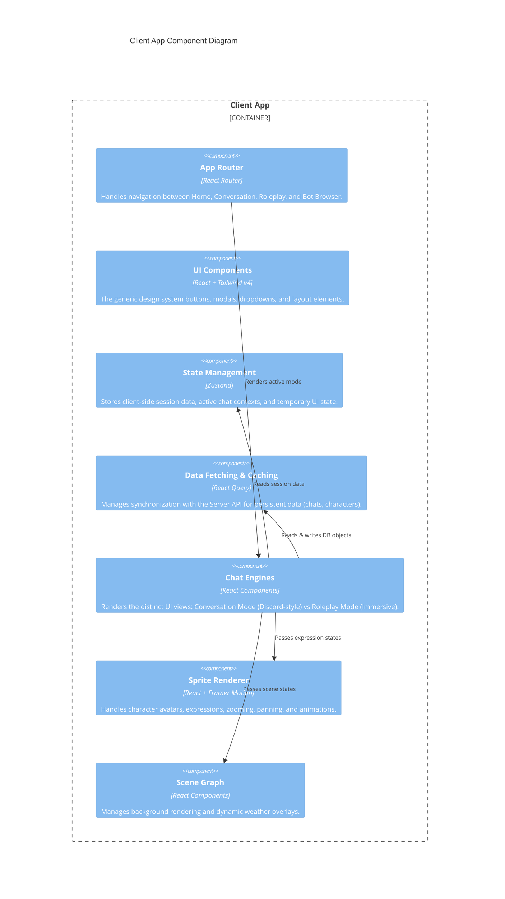

# C4 Level 3: Component Diagram

The Component diagram breaks down the Server and Client containers to identify the major logical building blocks that make up the engine.

## Server API Components (`packages/server`)

```mermaid
C4Component
  title Server API Component Diagram
  
  Container_Boundary(server, "Server API") {
    Component(routes, "API Routes", "Fastify", "HTTP endpoints for chat, characters, generation, and settings.")
    
    Component(agent_runner, "Agent Runner System", "TypeScript", "Executes the 25+ AI agents before, during, and after chat turns (e.g. World State, Narrator, Combat).")
    Component(llm_manager, "LLM Connection Manager", "TypeScript", "Abstracts API calls to OpenAI, Anthropic, OpenRouter, and local pipelines.")
    Component(prompt_pipeline, "Prompt Pipeline", "TypeScript", "Assembles prompts. Handles macros ({{char}}), lorebook insertion, and regex find/replace scripts.")
    Component(lorebook_engine, "Lorebook Engine", "TypeScript", "Performs chunked retrieval and keyword scanning to pull context into the prompt.")
    Component(image_service, "Image Generation Service", "TypeScript", "Handles workflows for generating scenes, avatars, and sprites.")
    Component(haptic_service, "Haptic Device Service", "TypeScript", "Sends commands to Buttplug.io devices based on Love Toys Control agent output.")
    
    Rel(routes, agent_runner, "Initiates chat turn")
    Rel(agent_runner, prompt_pipeline, "Requests prompt assembly")
    Rel(prompt_pipeline, lorebook_engine, "Requests active context extracts")
    Rel(agent_runner, llm_manager, "Dispatches generation tasks")
    Rel(routes, image_service, "Requests visual assets")
    Rel(agent_runner, haptic_service, "Triggers hardware events")
  }

  SystemDb_Ext(db, "SQLite Database", "Stores persistent states")
  Rel(server, db, "Reads & Writes using Drizzle ORM")
```

## Client App Components (`packages/client`)



## Data Flow (High Level)

1. **User Input:** Player types a message in the Client App (`Chat Engine`).
2. **Dispatch:** The Client App sends it via HTTP to the Server API (`API Routes`).
3. **Turn Start:** The `Agent Runner` kicks in. Pre-generation agents examine the input.
4. **Assembly:** The `Prompt Pipeline` gathers the character data, user personas, chat history, and asks the `Lorebook Engine` for active lorebook entries.
5. **Generation:** The final prompt is sent securely by the `LLM Connection Manager` to an external API (like Claude or GPT-4).
6. **Processing:** The streamed text hits post-generation agents. Regex scripts modify the text. Image generation paths might be conditionally triggered based on agent analysis.
7. **Return:** The finalized message text, updated tracker state, and visual cues are returned via HTTP to the Client App to update the UI.
