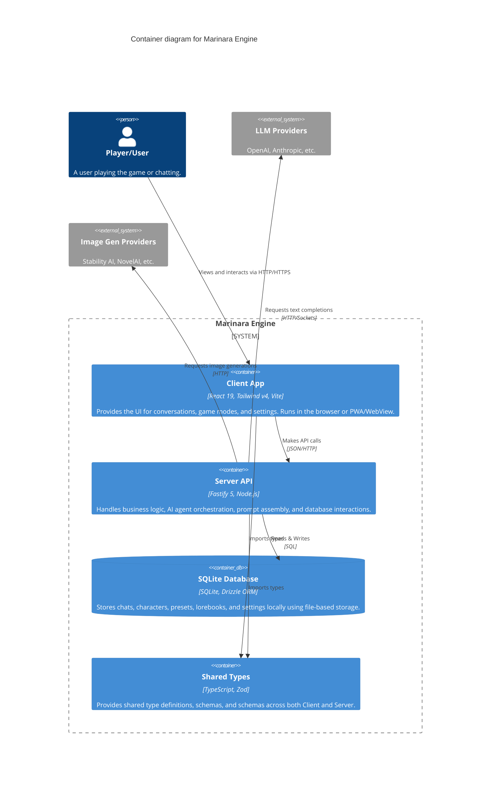

# C4 Level 2: Container Diagram

The Container diagram zooms into the Marinara Engine system to show its major logical deployable units (containers).

## Diagram

## Containers

1.  **Client App (`packages/client`)**: A single-page application built with React. It uses Zustand for state management and React Query for data fetching. It connects to the server API to manage the UI states for the Conversation, Roleplay, and Game modes.
2.  **Server API (`packages/server`)**: A Fastify Node.js server. This is the heart of the engine. It manages the agent processing pipeline, routing HTTP requests to LLM providers, generating responses, running specialized AI agents (like World State, Quest Tracker, Combat), and reading/writing to the local database.
3.  **SQLite Database**: Embedded local database managed via Drizzle ORM. Keeps track of all historical data, chats, and configurations locally on the user's machine without the need for cloud sync.
4.  **Shared Types (`packages/shared`)**: Contains Zod validators, schemas, and shared constants. Ensures data integrity and type safety across the Client-Server boundary.
