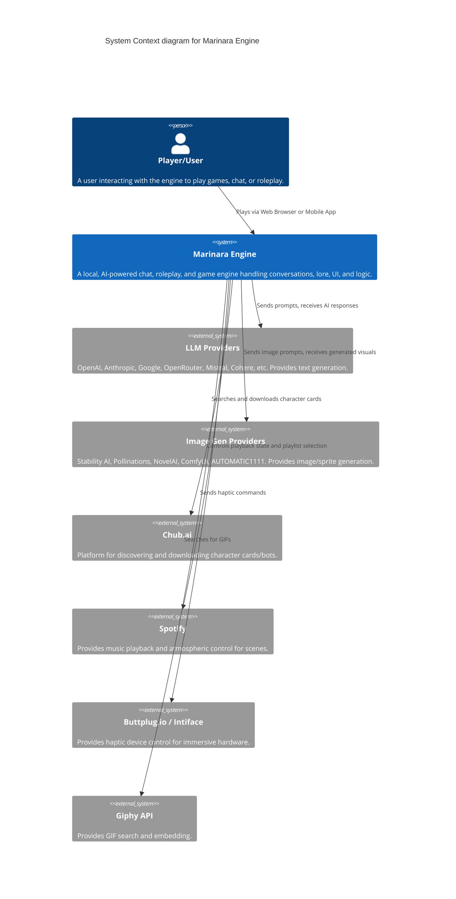

# C4 Level 1: System Context Diagram

The System Context diagram is a high-level view showing the Marinara Engine and how it interacts with users and external systems.

## Diagram

## Elements

*   **Player/User**: The primary actor using the engine via a browser, PWA, or WebView wrap.
*   **Marinara Engine**: The core web app running locally (on Docker, Windows, macOS/Linux, or Android/Termux).
*   **LLM Providers**: The brain of the characters and agents, using user-provided API keys or local configurations.
*   **Image Gen Providers**: The source of dynamic character avatars, background images, and scene visuals.
*   **Chub.ai**: A major community hub directly integrated into the app for pulling content.
*   **Spotify**: Integrated directly for scene-based music control via the "Spotify DJ" agent.
*   **Buttplug.io**: Integrated for haptic hardware via the "Love Toys Control" agent.
*   **Giphy API**: Used for searching and inserting animated images.
