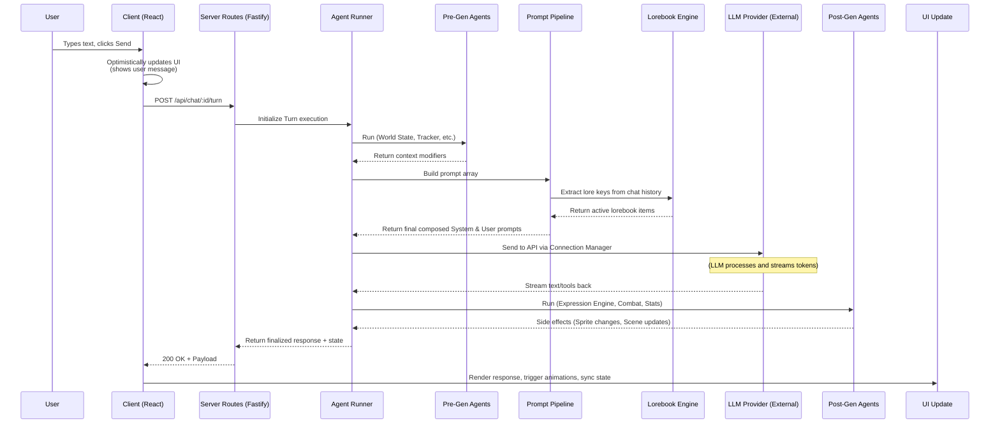

# Data Flow: The Lifecycle of a Message

This document explains the step-by-step data flow of a simple chat turn inside Marinara Engine. What happens from the moment the player hits "Send" to the moment the character replies?

## Turn Lifecycle

### 1. Client Dispatch
When a user sends a message, the React app uses `React Query` to make a POST request to the `/api/chat/:id/turn` endpoint. It optimistically updates the local Zustand state so the message appears instantly in the chat box.

### 2. The Agent Runner: Pre-Generation
The API delegates the request to the `Agent Runner`. The runner looks at the active agents for the current chat and executes the **Pre-Generation phase**. 
- Agents like the `World State` inject the current time/weather into the context.
- The `Illustrator` might decide to trigger an image generation prompt.

### 3. Prompt Assembly & Lorebook Activation
The `Prompt Pipeline` kicks in. It takes the character's core definitions (persona, backstory), the system prompt preset, the recent chat history, and any context injected by the pre-gen agents.
- It scans the chat history for keywords matching the `Lorebook Engine`.
- If keywords are found, the relevant lore entries are chunked and appended to the prompt payload.
- Macros (`{{char}}`, `{{user}}`) are hydrated with actual values.

### 4. LLM Generation
The Server's Connection Manager picks the correct connection (e.g., Anthropic Claude API) and securely sends the assembled payload. It waits for the stream of text.

### 5. Post-Generation & Side Effects
After the text is generated, the `Agent Runner` executes the **Post-Generation phase**.
- The `Expression Engine` agent reads the sentiment of the generated text and selects the appropriate avatar sprite.
- Regex Scripts might run to normalize capitalization or remove asterisks.
- The `Combat` agent might update HP tracking if a hit occurred.
- The `Haptic Service` might trigger the Buttplug.io hardware.

### 6. Client Sync
Once the turn finishes, the API returns the final AI message, plus any state side-effects (like a background change or expression update). The Client updates the Zustand store and the UI animations trigger dynamically.
