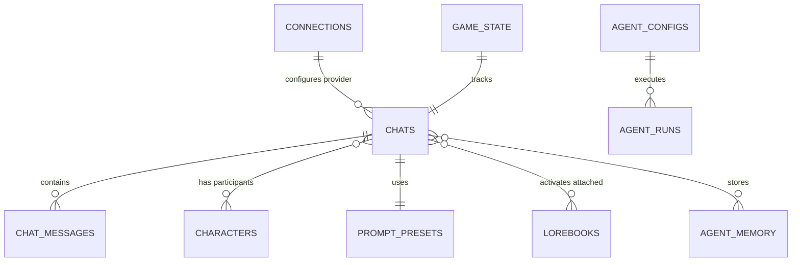

# Database Schema

Marinara Engine uses **SQLite** through **Drizzle ORM** for lightweight, portable, file-based persistence that works fully offline. Below are the key domain entities mapping to the database schemas located in `packages/server/src/db/schema/`.

## Core Entities

### Characters (`characters.ts`)
The foundational AI entity representing an NPC or companion.
- **Fields:** Name, Avatar Image, Creator Notes, Tags, Description.
- Contains the character's system prompts, greeting messages, and personality matrix.

### Chats (`chats.ts`)
A specific instance of a conversation.
- A Chat links a User/Persona to one or more Characters (Group chats are supported).
- **Messages:** An array or table holding the history of the conversation, user actions, and agent responses. Branches/swipes are saved here.
- Stores local override settings like which agents are enabled specifically for this chat.

### Connections (`connections.ts`)
Encrypted credentials to external LLM or Image providers.
- **Providers Supported:** OpenAI, Anthropic, Google, Mistral, Local Web UIs.
- Contains an AES-encrypted API token to ensure keys are safe at rest.

### Prompts & Presets (`prompts.ts`, `chat-presets.ts`)
Configuration rules for how the final LLM prompt is assembled.
- **Prompt Sections:** Determine the order of fields (e.g. Memory, then Character Sheet, then Chat History).
- Defines token limits and contextual constraints.

### Agents (`agents.ts`)
Configurations and running state for dynamic AI agents.
- **Agent Configs:** Defines system prompts, phases (pre_generation, post_processing), and settings for different agents.
- **Agent Memory:** Key-value store for per-agent persistent memory.
- **Agent Runs:** Logging of tokens used and output results for agent executions.

### Lorebooks (`lorebooks.ts`)
World-building encyclopedias triggered by keywords.
- Holds discrete entries with specific activation keys.
- If a user mentions `The Emerald Sword` in chat, the engine searches the Lorebook for that key and retrieves the item's background lore to inject into the prompt.

### Game State & Checkpoints (`game-state.ts`, `checkpoints.ts`)
Used primarily for Game and Roleplay mode tracking.
- Tracks active quests, player HP, inventory arrays, time of day, weather, and world location. 
- Agent trackers hook into these fields to serialize context over long sessions.

## High-Level ERD (Entity Relationship)

